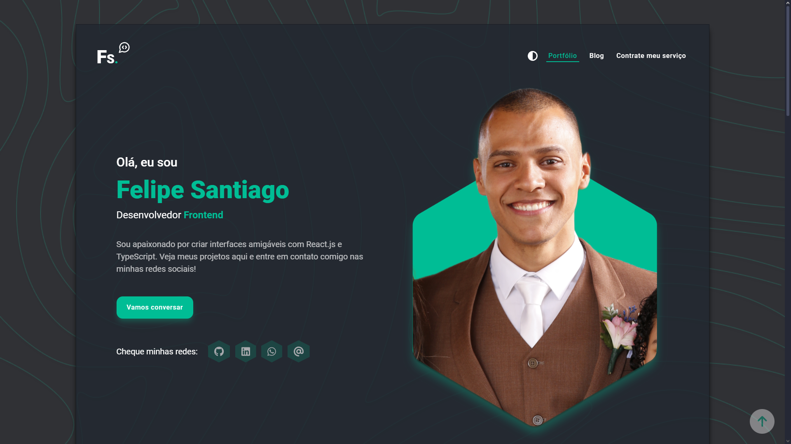

# Projeto pessoal - Portfólio Felipe Santiago

Veja o projeto completo na web em: [Portfólio Felipe Santiago](https://portfoliofelipesantiago.vercel.app)

## Sumário

- [Imagens](#imagens)
  - [Visualização geral](#visualização-geral-pelo-desktop)
  - [Responsividade](#responsividade)
- [Bibliotecas](#bibliotecas)
  - [Dependências](#dependências)
  - [Dependências de Desenvolvimento](#dependências-de-desenvolvimento)
- [Objetivos do projeto](#objetivos-do-projeto)
- [Funcionalidades](#funcionalidades)

## Imagens

### Visualização geral

### Responsividade

## Bibliotecas

### Dependências

- [@apollo/client](https://www.apollographql.com/docs/react/): Biblioteca para gerenciar dados remotos usando GraphQL em aplicações React, facilitando a interação com APIs GraphQL.

- [@fortawesome](https://docs.fontawesome.com/web/use-with/react): Biblioteca FontAwesome focada no uso de ícones SVG em aplicações React.

- [@hookform/resolvers](https://react-hook-form.com/advanced-usage#Resolver): Pacote de resolvers para integrar bibliotecas de validação, como Zod, com o React Hook Form, simplificando a validação de formulários.

- [@paralleldrive/cuid2](https://github.com/paralleldrive/cuid2): Algoritmo gerador de IDs únicos para os dados no banco de dados.

- [@radix-ui/themes](https://www.radix-ui.com/docs/primitives/overview): Biblioteca para implementar temas e estilos consistentes em componentes de UI acessíveis.

- [github-automated-repos](https://www.npmjs.com/package/github-automated-repos): Biblioteca para gerenciar repositórios no GitHub de forma automatizada.

- [html-react-parser](https://github.com/wix/html-react-parser): Biblioteca para analisar HTML e convertê-lo em componentes React, facilitando a manipulação de conteúdo HTML.

- [lucide-react](https://lucide.dev): Biblioteca que fornece ícones e símbolos para React.

- [react-collapse](https://github.com/nkbt/react-collapse): Componente React para implementar animações de expansão e colapso (efeito carrosel).

- [react-hook-form](https://react-hook-form.com/): Biblioteca para gerenciamento de formulários em React, focada em validação e envio de dados.

- [react-router-dom](https://reactrouter.com/): Biblioteca para gerenciar rotas em aplicações React, facilitando a navegação entre diferentes páginas.

- [swiper](https://swiperjs.com/): Biblioteca para criar carrosséis e sliders em aplicações web, com suporte a toque e navegação por gestos.

- [tailwind-merge](https://www.npmjs.com/package/tailwind-merge): Combina classes do Tailwind CSS, especialmente quando há conflitos de estilos.

- [tailwind-variants](https://www.tailwind-variants.org): Biblioteca que ajuda a gerenciar e aplicar variantes de estilos no Tailwind CSS.

- [vite-tsconfig-paths](https://www.npmjs.com/package/vite-tsconfig-paths): Permite que o Vite reconheça e use os aliases de importação, simplificando importações. Exemplo, trocar um caminho longo como "../../../components/navbar" por "@components/navbar".

- [zod](https://zod.dev/): Biblioteca de validação de esquemas que garante a segurança dos dados.

### Dependências de Desenvolvimento

- [eslint](https://eslint.org/): Ferramenta de linting para identificar e corrigir problemas de estilo e qualidade de código.

- [postcss](https://postcss.org/): Ferramenta para transformar estilos CSS com plugins.

- [prettier](https://prettier.io/): Ferramenta de formatação de código que garante consistência no estilo do código.

- [tailwindcss](https://tailwindcss.com/): Framework CSS com classes utilitárias que facilita a estilização de elementos HTML/JSX.

## Objetivos do projeto

- Criar uma sessão de portfólio divida em:
  - Hero: Apresentação inicial;
  - Sobre mim: Informações adicionais, o que faço e opções de baixar os currículos em pt-BR e en-US;
  - Habilidades: Listagem de soft skills e habilidades técnicas;
  - Projetos: Listagem de projetos realizando vinculo direto com repositórios GitHub utilizando a biblioteca [github-automated-repos](https://www.npmjs.com/package/github-automated-repos);
- Criação de um blog pessoal utilizando Hygraph e manipulando dados através de queries GraphQL.
  - Listagem de publicações
  - Sistema de pesquisa através do título e filtros personalizados
  - Criação de sistema de paginação dos posts, carregados de 10 em 10.
- Sessão para entrar em contato para solicitar meus trabalhos
  - Landing page sobre meu trabalho e links para contato.

## Funcionalidades

