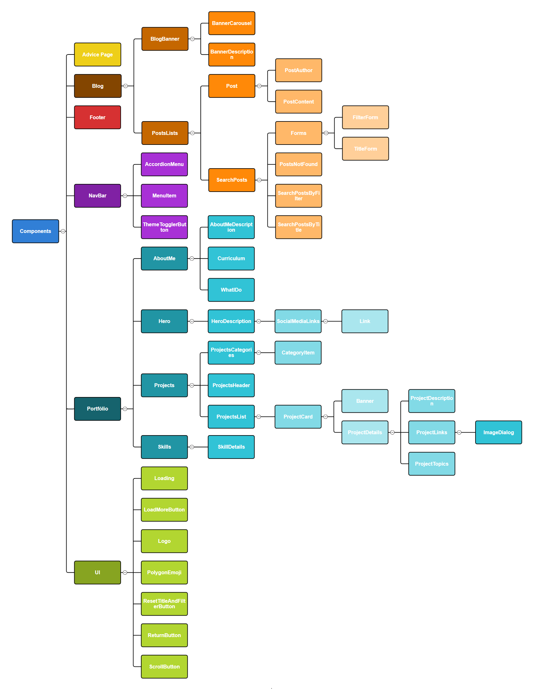

# Projeto pessoal - Portfólio Felipe Santiago

Veja o projeto completo na web em: [Portfólio Felipe Santiago](https://portfoliofelipesantiago.vercel.app)


## Sumário

- [Imagens](#imagens)
  - [Visualização geral](#visualização-geral-pelo-desktop)
  - [Responsividade](#responsividade)
- [Bibliotecas](#bibliotecas)
  - [Dependências](#dependências)
  - [Dependências de Desenvolvimento](#dependências-de-desenvolvimento)
- [Objetivos do projeto](#objetivos-do-projeto)
- [Funcionalidades](#funcionalidades)
  - [Footer](#footer)
  - [NavBar](#navbar)
    - [Esquema de troca de temas](#esquema-de-troca-de-temas)
      - [Componente ThemeTogglerButton](#componente-themetogglebutton)
      - [Funcionamento](#funcionamento)
  - [Advice Page](#advice-page)
  - [Portfólio](#portfólio) -[Github Automated Repos](#github-automated-repos)
    - [Github: localização do repositório](#github-localização-do-repositório)
  - [Blog](#blog)
    - [Consulta GraphQL](#consulta-graphql)
    - [useQuery](#usequery)
    - [fetchMore](#fetchmore)
- [Autor](#autor)

## Imagens

### Visualização geral


### Responsividade


## Bibliotecas

### Dependências

- [@apollo/client](https://www.apollographql.com/docs/react/): Biblioteca para gerenciar dados remotos usando GraphQL em aplicações React, facilitando a interação com APIs GraphQL.

- [@fortawesome](https://docs.fontawesome.com/web/use-with/react): Biblioteca FontAwesome focada no uso de ícones SVG em aplicações React.

- [@hookform/resolvers](https://react-hook-form.com/advanced-usage#Resolver): Pacote de resolvers para integrar bibliotecas de validação, como Zod, com o React Hook Form, simplificando a validação de formulários.

- [@paralleldrive/cuid2](https://github.com/paralleldrive/cuid2): Algoritmo gerador de IDs únicos para os dados no banco de dados.

- [@radix-ui/themes](https://www.radix-ui.com/docs/primitives/overview): Biblioteca para implementar temas e estilos consistentes em componentes de UI acessíveis.

- [github-automated-repos](https://www.npmjs.com/package/github-automated-repos): Biblioteca para gerenciar repositórios no GitHub de forma automatizada.

- [html-react-parser](https://github.com/wix/html-react-parser): Biblioteca para analisar HTML e convertê-lo em componentes React, facilitando a manipulação de conteúdo HTML.

- [lucide-react](https://lucide.dev): Biblioteca que fornece ícones e símbolos para React.

- [react-collapse](https://github.com/nkbt/react-collapse): Componente React para implementar animações de expansão e colapso (efeito carrosel).

- [react-hook-form](https://react-hook-form.com/): Biblioteca para gerenciamento de formulários em React, focada em validação e envio de dados.

- [react-router-dom](https://reactrouter.com/): Biblioteca para gerenciar rotas em aplicações React, facilitando a navegação entre diferentes páginas.

- [swiper](https://swiperjs.com/): Biblioteca para criar carrosséis e sliders em aplicações web, com suporte a toque e navegação por gestos.

- [tailwind-merge](https://www.npmjs.com/package/tailwind-merge): Combina classes do Tailwind CSS, especialmente quando há conflitos de estilos.

- [tailwind-variants](https://www.tailwind-variants.org): Biblioteca que ajuda a gerenciar e aplicar variantes de estilos no Tailwind CSS.

- [vite-tsconfig-paths](https://www.npmjs.com/package/vite-tsconfig-paths): Permite que o Vite reconheça e use os aliases de importação, simplificando importações. Exemplo, trocar um caminho longo como "../../../components/navbar" por "@components/navbar".

- [zod](https://zod.dev/): Biblioteca de validação de esquemas que garante a segurança dos dados.

### Dependências de Desenvolvimento

- [eslint](https://eslint.org/): Ferramenta de linting para identificar e corrigir problemas de estilo e qualidade de código.

- [postcss](https://postcss.org/): Ferramenta para transformar estilos CSS com plugins.

- [prettier](https://prettier.io/): Ferramenta de formatação de código que garante consistência no estilo do código.

- [tailwindcss](https://tailwindcss.com/): Framework CSS com classes utilitárias que facilita a estilização de elementos HTML/JSX.

## Objetivos do projeto

- Criar uma sessão de portfólio divida em:
  - Hero: Apresentação inicial;
  - Sobre mim: Informações adicionais, o que faço e opções de baixar os currículos em pt-BR e en-US;
  - Habilidades: Listagem de soft skills e habilidades técnicas;
  - Projetos: Listagem de projetos realizando vinculo direto com repositórios GitHub utilizando a biblioteca [github-automated-repos](https://www.npmjs.com/package/github-automated-repos);
- Criação de um blog pessoal utilizando Hygraph e manipulando dados através de queries GraphQL.
  - Listagem de publicações
  - Sistema de pesquisa através do título e filtros personalizados
  - Criação de sistema de paginação dos posts, carregados de 10 em 10.
- Sessão para entrar em contato para solicitar meus trabalhos
  - Landing page sobre meu trabalho e links para contato.

## Funcionalidades

O esquema de organização de pastas é possível ser vista neste diagrama:



Há outras pastas que possuem as imagens, páginas, funções, queries, interfaces e tipos, etc. Mas vamos resumir a funcionalidade do projeto através de seus componentes. Não vamos explicá-los em ordem, mas sim no nível de complexidade do componente.

### Footer

O Footer é o rodapé da página onde é possível visualizar a logo, os links de navegação da página e os links das redes sociais. Nenhuma lógica complexa.

### NavBar

A barra de navegação incorpora todo o cabeçalho, contendo os links de navegação no `AccordionMenu`, o `MenuItem` seria o link individual do menu, transformado em um componente reutilizável, para que não importa quantos links sejam adicionados, só será necessário adicioná-lo no arquivo json que comporta algumas informações do arquivo e ela será chamada no método `map` dentro do `NavBar` e renderizada. Por fim, o esquema de troca de tema da página foi focada no `ThemeTogglerButton`.

#### Esquema de troca de temas

Nossa aplicação utiliza TailwindCSS para estilizações, e personalizamos cores, fontes e outros aspectos no arquivo `tailwind.config.js`. A configuração abaixo demonstra como as variáveis de CSS são usadas para permitir a troca de temas:

```js
export default {
  content: ["./index.html", "./src/**/*.{js,ts,jsx,tsx}"],
  darkMode: "class",
  theme: {
    extend: {
      colors: {
        primary: "var(--primary)",
        secondary: "var(--secondary)",
        tertiary: "var(--tertiary)",
        bg: "var(--bg)",
        panel: "var(--panel)",
        secondaryPanel: "var(--secondaryPanel)",
        textColor: "var(--textColor)",
        hoverEffect: "var(--hoverEffect)"
      },
      // ...
```

Com a propriedade `darkMode` ativada, o TailwindCSS reconhece que a aplicação alternará entre os modos dark e light. As cores são configuradas com a função `var(--nome)` para fazer referência às variáveis CSS definidas no arquivo de estilo principal, no nosso caso, em `"./src/index.css"`.

O tema dark é o padrão da aplicação, e as cores são definidas diretamente no `:root` (as variáveis de estilo raiz). Já para o tema light, utilizamos a classe `.light`, que contém as variáveis CSS correspondentes:

```css
.light {
  --primary: #00bd95;
  --secondary: #19584f;
  --tertiary: #f3eeea;
  --bg: #d8d2c2;
  --panel: #f3eeeab0;
  --secondaryPanel: #dfd6c6;
  --textColor: #000000;
  --hoverEffect: #dadada;
}

:root {
  --primary: #00bd95;
  --secondary: #19584f;
  --tertiary: #20272f;
  --bg: #303135;
  --panel: #20272fc7;
  --secondaryPanel: #171c22;
  --textColor: #ffffff;
  --hoverEffect: #ffffff;
}
```

### Componente ThemeToggleButton

Para alternar entre os temas, criamos o componente `ThemeToggleButton`, que gerencia a troca do tema globalmente. Ele utiliza o `useState` para armazenar o estado atual do tema e, ao clicar no botão, a função `toggleTheme` é acionada, alterando a classe `light` no `body`, o que permite alternar facilmente entre os temas sem precisar modificar outros componentes.

```tsx
import { useState } from "react";

export const ThemeToggleButton = () => {
  const [theme, setTheme] = useState("dark");

  const toggleTheme = () => {
    const newTheme = theme === "dark" ? "light" : "dark";
    setTheme(newTheme);
    document.body.classList.toggle("light", newTheme === "light");
  };

  return <button onClick={toggleTheme}>{/*...Resto do código*/}</button>;
};
```

### Funcionamento

- O tema dark é definido como padrão e está nas variáveis de `:root`.
- Ao clicar no botão, o estado do tema é alternado entre **dark** e **light**, e a classe `light` é adicionada ou removida do body, aplicando as novas cores definidas no CSS.

Com essa abordagem, o tema é alternado globalmente, simplificando a gestão de estilos para toda a aplicação.

### Advice Page

Componente reutilizável em todos os locais onde há um aviso, como página não encontrada, página em desenvolvimento, conteúdo não encontrado, entre outros. Já que todos estes avisos seguiam o mesmo padrão de estilização, com pequenas alterações, o componente `AdvicePage` foi criado. Esta é o `type` das props deste componente, que podem ser alternadas.

```tsx
interface IAdvicePageProps {
  title: string;
  adviceMessage: string;
  route: string;
  buttonText: string;
  icon: IconDefinition;
  polygonEmojiMessage?: string;
};
```

Este é o resultado:


De cima para baixo temos:

- `title: string`
- `icon: IconDefinition`: IconDefinition é a tipagem fornecida pela biblioteca FontAwesome para os ícones
- `polygonEmojiMessage?: string`
- `adviceMessage: string`
- `buttonText: string`
- `route: string`: é a rota onde o componente `Link` fornecido pelo [react-router-dom](https://reactrouter.com/) irá redirecionar o usuário diante desta página.

### Portfólio

Aqui fica a estrutura inicial do projeto, onde chamaríamos de **Home**, onde possui os componentes:

- Hero: Apresentação inicial do site
- AboutMe: Responsável por destacar informações sobre mim, Felipe.
- Projects: Os projetos do portfólio, onde abordaremos mais o uso do [github-automated-repos](https://www.npmjs.com/package/github-automated-repos), responsável por vincular nosso projeto ao GitHub.
- Skills: Detalhes sobre softskills e habilidades técnicas na área de programação
- UI: Pequenos componentes reutilizáveis ao longo de toda aplicação, como botões, componentes de carregamento, etc.

### Github Automated Repos

O foco principal aqui é mostrar meus principais projetos do GitHub. Para isso, foi utilizada uma biblioteca que fornece um hook chamado `useGitHubAutomatedRepos`, que recebe dois parâmetros: o nome de usuário do GitHub e uma palavra-chave.

O que facilita o uso dessa biblioteca é que você pode modificar seu portfólio diretamente da sua conta do GitHub, sem a necessidade de acessar o repositório para alterar o código manualmente.

Na seção "about" do seu repositório no GitHub, é possível adicionar algumas informações:

- A descrição do seu projeto;
- O site do projeto (eu uso o Vercel, que preenche esse campo automaticamente quando o deploy do projeto é feito);
- O campo de tópicos, onde você pode adicionar palavras-chave que descrevem seu projeto.

Através do campo de tópicos, o hook `useGitHubAutomatedRepos` acessa todos os seus projetos que possuem uma palavra-chave específica e cria um array com eles.

A sintaxe é assim:

```js
const data = useGitHubAutomatedRepos("seuApelido", "palavraChave");
```

Todos os projetos que eu gostaria de exibir no meu portfólio possuem a palavra-chave "portfolio" ou a que você decidir. Dessa forma, usando a variável "data", posso renderizar na tela todas as informações sobre meus projetos, como nome, banner, descrição, tópico, página da web, repositório do GitHub, e mais.

Se eu quiser adicionar um novo repositório ao meu portfólio ou remover algum, basta alterar seus tópicos diretamente no GitHub.

Se você se interessar, acesse a documentação [aqui](https://github.com/DIGOARTHUR/github-automated-repos/).

#### Github: localização do repositório


### Blog

Aqui temos a parte mais complexa do projeto. Foi utilizado Hygraph que é uma plataforma de gerenciamento de conteúdo headless, que é como um serviço inteligente para gerenciar conteúdo, tipo um banco de dados onde podemos armazenar textos, imagens e qualquer outro tipo de informação que quiser exibir no seu site ou aplicativo. Ele funciona com uma abordagem chamada headless (sem cabeça), que significa que ele só se preocupa com o conteúdo, enquanto podemos criar e personalizar a exibição desse conteúdo de qualquer maneira que preferir, usando tecnologias front-end.

Outro termo é a **API GraphQL**. Uma API é uma forma de comunicação entre diferentes sistemas e GraphQL é uma linguagem de consulta para essas APIs. A API GraphQL do Hygraph nos permite pedir exatamente os dados que precisamos e nada mais, tornando as requisições mais eficientes.

Com Hygraph é possível definir tipos de conteúdo (por exemplo, posts, autores), estruturar seus dados em um esquema de formulário e então usar a API GraphQL para buscar esses dados em suas aplicações Front-end. É particularmente útil para blogs, pois permite atualizações fáceis de conteúdo, escalabilidade e uma integração suave com estruturas, já que usamos o React aqui.


Quando definimos o esquema do projeto, na janela de conteúdo o cliente pode adicionar novos posts e autores ao seu blog. Depois disso, só precisamos configurá-lo na aplicação React usando [Apollo-Client](https://www.apollographql.com/docs/react), conforme recomendado pelos documentos do Hygraph.

[Apollo-Client](https://www.apollographql.com/docs/react) é uma biblioteca popular de gerenciamento de estado que simplifica o trabalho com APIs GraphQL em aplicativos JavaScript, especialmente React. Ele fornece ferramentas para consultar, armazenar em cache e gerenciar dados obtidos de uma API GraphQL, como Hygraph, que estamos usando aqui.

O uso do Apollo Client com Hygraph é recomendado porque nos permite lidar com consultas e mutações do GraphQL com eficiência, gerenciar o estado do aplicativo e armazenar dados em cache localmente para reduzir solicitações de rede desnecessárias. O Apollo Client também oferece recursos como atualizações automáticas de consultas, paginação e tratamento de erros, facilitando a integração e o gerenciamento dos dados do Hygraph no React.

#### Consulta GraphQL

```ts
export const GET_POSTS_BY_TITLE_QUERY = gql`
  query GetPostsByTitle($title: String!, $after: String, $first: Int!) {
    postsConnection(
      where: { title_contains: $title }
      after: $after
      first: $first
    ) {
      pageInfo {
        hasNextPage
        endCursor
      }
      edges {
        node {
          id
          title
          subtitle
          image {
            url
          }
          author {
            name
          }
        }
      }
    }
  }
`;
```

Esta é uma consulta básica usando gql(GraphQL) fornecido pela biblioteca Apollo-Client. Nesta query definimos quais propriedades precisam ser definidas na query, como `title`, `after`que seria o id do último dado da query, para sabermos qual é o próximo dado a ser consultado, caso usemos paginação no site, e `first` que seria quantos dados seriam buscados a cada novo fetch de dados. O `first` é necessário, pois levando em conta que estamos manipulando um banco de dados, em requisições onde há dezenas, centenas ou milhares de dados isso sobrecarregaria o servidor e a aplicação. Assim o `first` define quantos dados serão buscados por vez a cada fetch de novos dados.
No exemplo acima, a informação `$first: Int!` é um dado `integer` obrigatório ser informado definido pelo `!` no final. Caso o `first`não seja informado os dados não são retornados, resultando em erro.

**Informações da consulta**

- postsConnection: O nome do nosso esquema é post, então temos as conexões dos posts. O nome é padrão para todas as consultas, modificando somente o nome do esquema. Aqui podemos definir que os dados retornados podem estar de acordo com uma palavra chave específica retornada pelo nosso Frontend `where: { title_contains: $title }` e de acordo com o `after: $after, first: $first` que definimos na nossa requisição.
- pageInfo: contém informações da query
  - endCursor: o id do último dado da query atual, para sabermos qual será o id do primeiro dado do próximo fetch de dados. Exemplo, vamos supor que o id dos dados vão de 1 até 20 e eu faço a cada 10 dados. o ID do último dado da primeira consulta seria 10, assim o GraphQL sabe que o id do próximo dado do fetch seria de 11 até 20 e assim por diante.
  - hasNextPage: Um valor booleano que nos informa de há mais dados para serem buscados ou se todos já foram retornados.
- edges: Array com os dados do banco
  - node: um objeto com as informações de um dado, no nosso caso uma publicação do blog.
    - Dentro do node temos os dados preenchidos no site do Hygraph onde podemos acessar na nossa publicação.

Assim os dados serão retornados como uma API ao utilizarmos o hook useQuery

#### useQuery

```tsx
const { postTitle } = useSearchPostByTitle();
const { loading, error, data, fetchMore } = useQuery<IPostsData>(
  GET_POSTS_BY_TITLE_QUERY,
  {
    variables: {
      title: postTitle,
      first: 10,
    },
  }
);
```

Para realizar a consulta da query no exemplo acima, precisamos definir as variáveis da consulta: `title` (que é o valor que o usuário define ao preencher um formulário no front-end para buscar novos dados. Este valor é retornado por um custom hook criado em um contexto React) e `first` (que define quantos dados serão retornados na primeira consulta).

As variáveis `loading`, `error` e `data` são utilizadas para indicar o estado da requisição:

- loading: enquanto a requisição está em progresso;

- error: se houve algum erro na requisição, como uma query estruturada incorretamente;

- data: os dados retornados caso a query tenha sido bem-sucedida.

Podemos utilizá-las assim:

```tsx
<div>
  {loading ? (
    <Loading />
  ) : error ? (
    <ErrorComponent />
  ) : (
    data && <PostsList data={data} />
  )}
</div>
```

Se a query ainda está sendo buscada, retorna uma mensagem de carregamento. Se houver um erro, retorna uma mensagem de erro. E se os dados forem retornados com sucesso, renderizamos esses dados.

#### FetchMore

A propriedade `fetchMore` do `useQuery` é usada para implementar paginação, caso a informação da query `hasNextPage` retorne `true`. A função responsável pela paginação tem a seguinte estrutura:

```tsx
const fetchMorePosts = () => {
  if (loading || error) return; // 1
  setIsLoading(true); // 2

  const endCursor = data?.postsConnection.pageInfo.endCursor; // 3
  fetchMore({
    variables: {
      after: endCursor,
      first: 10,
    }, // 4
    updateQuery(previousResult, { fetchMoreResult }) {
      // 5
      setIsLoading(false); // 6

      if (!fetchMoreResult) return previousResult; // 7

      return {
        // 8
        postsConnection: {
          ...previousResult.postsConnection,
          edges: [
            ...previousResult.postsConnection.edges,
            ...fetchMoreResult.postsConnection.edges,
          ],
        },
      };
    },
  });
};
```

1. Nossa função não segue a consulta caso ainda esteja em carregamento ou erro.

2. Criamos um estado com `useState` específico para verificar se o fetch de novos dados ainda está em carregamento ou se foi concluído. Aqui o definimos como `true`, pois os dados vão começar a ser buscados.

3. O `endCursor` é uma propriedade retornada da nossa query dentro do `pageInfo`, que é o ID do último dado disponível, para sabermos quais são os próximos dados a serem buscados.

4. A função `fetchMore` do `useQuery` recebe como primeiro parâmetro um objeto com as variáveis que definem a partir de qual dado devem iniciar a busca (utilizando o ID como referência) e quantos dados devem ser buscados nessa nova query (10).

5. O segundo parâmetro do `fetchMore` é a função `updateQuery`, que irá atualizar a consulta dos nossos dados. Ela recebe como parâmetros os dados das queries já realizadas (`previousResult`) e os novos dados buscados (`fetchMoreResult`).

6. Neste ponto, a consulta foi concluída, então o estado de loading é definido como `false`.

7. Caso não haja mais novos dados para serem pesquisados, o `fetchMore` retorna somente os dados anteriores.

8. Caso haja novos dados, nós atualizamos nossa query, onde as informações anteriores, como o `pageInfo`, permanecem com os dados já existentes, mas agora nosso `edges`, que contém os dados, é atualizado para incluir tanto os dados anteriores (`...previousResult.postsConnection.edges`) quanto os novos (`...fetchMoreResult.postsConnection.edges`).

Assim, enviamos essa função para dentro de algum botão que será responsável por carregar novos dados, assim o nosso `data` já será atualizado com os dados novos e renderizado em tela.

Assim abrangemos todos os pontos da nossa aplicação, até o momento, mas muito mais será desenvolvido.

### Certificates

Essa sessão foca em utilizar também do hygraph e graphql para listar os certificados recebidos até o dia de hoje e automatizar o processo de listagem.

Os certificados são organizados de acordo com a data de emissão.

Os processos de `fetchMore` e listagem de dados foi criado da mesma forma que os posts.

## Autor

- GitHub - [Felipe Santiago Morais](https://github.com/SantiagoMorais)
- Linkedin - [Felipe Santiago](https://www.linkedin.com/in/felipe-santiago-873025288/)
- Instagram - [@felipe.santiago.morais](https://www.instagram.com/felipe.santiago.morais)
- Email - <a href="mailto:contatofelipesantiago@gmail.com" target="blank">contatofelipesantiago@gmail.com</a>
- <a href="https://api.whatsapp.com/send?phone=5531996951033&text=Hi%2C%20Felipe%21%20I%20got%20your%20contact%20from%20your%20portfolio.">Whatsapp</a>
